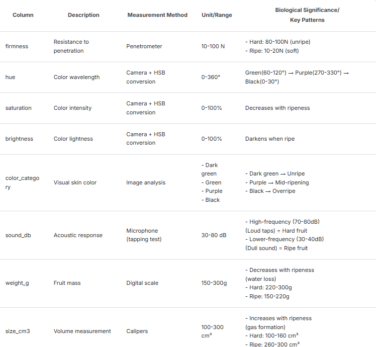
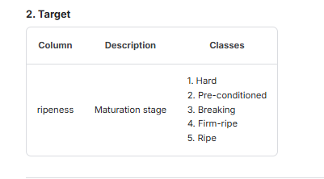

About Dataset
Hass avocado is a popular variety of avocado known for its distinctive pebbly, dark green to black skin and creamy, buttery flesh when ripe. It's a large fruit, and is the most common commercial variety globally.

A synthetic dataset simulating measurements designed for a classification task in predicting avocado ripeness stages using physical characteristics.

